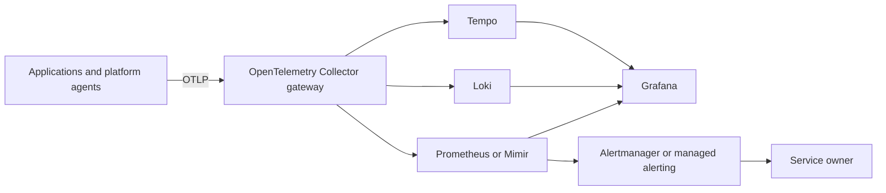

# Observability & SRE Playbooks

A practical observability and site reliability engineering portfolio built around OpenTelemetry, Prometheus-compatible metrics, Grafana, Loki and Tempo. The repository connects telemetry configuration to customer-centred SLIs, SLOs, burn-rate alerts and incident runbooks.

## What this repository demonstrates

- OpenTelemetry Collector gateway configuration for metrics, logs and traces
- Memory protection, batching, resource detection and telemetry health endpoints
- Prometheus recording rules for request rate, error ratio and latency
- Multi-window SLO burn-rate alerts instead of static symptom thresholds
- An OpenSLO service-level objective example
- Runbooks for high error rate and Tempo/object-store connectivity failures
- Architecture and operational ownership decisions

## Architecture



## Repository layout

```text
.
├── otel/collector.yaml
├── prometheus/recording-rules.yaml
├── prometheus/alert-rules.yaml
├── slo/api-availability.yaml
├── runbooks/high-error-rate.md
├── runbooks/tempo-object-store-timeout.md
└── docs/architecture.md
```

## Core SRE idea

Infrastructure health is useful context, but reliability objectives should measure what customers experience. For an API, a meaningful availability SLI is normally the proportion of eligible requests completed successfully—not whether a pod exists or a CPU threshold was crossed.

A 99.9% SLO permits an error budget of 0.1% over its measurement window. Burn-rate alerts ask how quickly that budget is being consumed. Fast-burn alerts page for acute incidents; slow-burn alerts create actionable work before the full budget is exhausted.

## Validation

Collector configuration can be checked with the matching Collector binary or container image:

```bash
otelcol-contrib validate --config otel/collector.yaml
```

Prometheus rule files can be checked with:

```bash
promtool check rules prometheus/recording-rules.yaml prometheus/alert-rules.yaml
```

Replace the example environment-variable endpoints before running the Collector. Authentication material should come from a secret manager or workload identity, never from this file.

## Operating model

- Application teams own the reliability of their services.
- The platform provides standards, telemetry pipelines, templates and coaching.
- Alerts must name an owner and link to a tested runbook.
- SLO breaches affect release and prioritization decisions.
- Telemetry volume, retention and cost are engineered explicitly.

## Data-safety note

All service names, endpoints, tenant labels and failure scenarios are synthetic. No production dashboards, logs, traces, bucket names, credentials or employer configuration are included.
